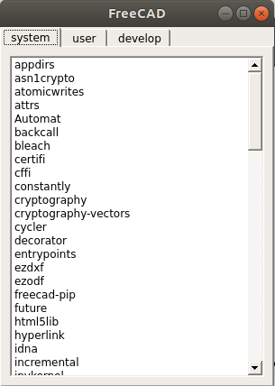

# pip-integration (FreeCAD >= 0.17)

To support pip installable freecad-packages we need to have a tool which allows to graphically install this modules.


## Install with pip directly:

`pip install https://github.com/looooo/freecad_pipintegration/archive/constraints.tar.gz`

## Install with pip from python command line (eg. from the FreeCAD-python-console)

```python
import subprocess as subp
import FreeCAD
url = "https://github.com/looooo/freecad_pipintegration/archive/constraints.tar.gz"
proc = subp.Popen(["pip", "install", url, "--user"], stdout=subp.PIPE, stderr=subp.PIPE)
out, err = proc.communicate()
FreeCAD.Console.PrintMessage(out.decode("utf8"))
FreeCAD.Console.PrintMessage(err.decode("utf8"))
```

## Console Usage:

```
from freecad.pip.app import pip
pip.list()              # print a list of all installed packages
pip.install("pkg_name")   # installs the package with pkg_name (if in freecad_modules.json)
pip.uninstall("pkg_name") # uninstall the package.
```

## Gui

```
from freecad.pip.gui import PipWidget
widget = PipWidget()
widget.show()
```



